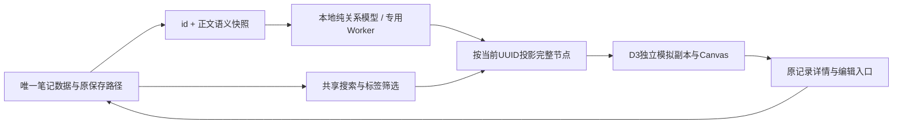

# 本地关联图架构与技术选型

更新：2026-10-05。✅ 基础结构来自0.5.0，本次源码新增局部关联阅读；历史制品和基础验证保留于下文，本轮证据见[视图用途验证](current/notes-view-purpose/verification.md)。⛔ 本轮没有新安装包，广泛设备、手势和完整MVP不以构建替代。

## 当前用途与局部阅读

✅ 二维图解释一条记录的联系及依据。选择记录后可切当前一层或两层，邻居点选即成为新中心；范围仅针对当前共享筛选及选定依据中的稀疏关系，不代表全量语义知识图。旧 3D 主题空间已于 2026-10-06 移除。

✅ 共同标签/正文词面筛选先裁边，再沿无向边取一层/两层节点；同时含两类证据的边可通过任一筛选，保留真实证据。画布、关联数、详情使用同一投影；全图保留全部匹配节点，局部保留零边中心，文字选择仍覆盖全部匹配UUID。显示当前范围与匹配总数，适配只作用于当前范围。

✅ 关联图内部选中和快速打开定位仍沿用同一 UUID 与共享筛选；新请求 UUID 在旧局部中心裁剪前生效，再交既有模拟和 token 定位。Ctrl/⌘ K 入口清筛选，详情定位保持筛选。外部定位不创建第二套笔记或导航状态，浮层宠物在图页隐藏以保护正文/依据阅读。历史空间曾提供「查看此条关联」入口，当前已随旧空间移除。

`graphView.ts`只做展示投影，不改变关系计算、Worker、存储和D3场景owner；坐标与镜头继续属于会话。

## GitHub 方案比较

| 方案 | 适合的场景 | 本轮取舍 |
| --- | --- | --- |
| [D3 force](https://github.com/d3/d3-force) + Canvas，配合D3 zoom/drag/selection | 自动布局、自定义绘制和精细的动画生命周期 | 采用。复用物理与交互模块，自管发光、帧调度、像素比和静态交互；代价是命中、坐标和卸载边界必须自己验证 |
| [react-force-graph](https://github.com/vasturiano/react-force-graph) 的独立2d组件 | 快速交付已有缩放、拖动、点选的动态图 | 成熟且有竞争力，交互维护更少。本轮需要控制Canvas像素上限和停止连续调度，采用D3窄模块；不能把组件的暂停用法误用当作它不支持静态交互 |
| [Cytoscape.js](https://github.com/cytoscape/cytoscape.js) | 拓扑编辑、图查询和多种图算法 | 当前关系是从笔记自动派生，复杂图模型和算法超出MVP；将来明确需要手工关系编辑时再评估 |
| [Sigma](https://github.com/jacomyal/sigma.js) + [Graphology](https://github.com/graphology/graphology) | 数千/万点的WebGL图 | 渲染规模优势明确，但增加图模型、WebGL和独立布局生命周期；没有实际规模证据前不提前引入 |
| [React Flow](https://github.com/xyflow/xyflow) | 富表单节点、端口、流程编辑和手工脑图 | 用户当前要自动运动的笔记点，不需要流程编辑；避免每帧更新大量React/DOM节点 |

采用D3四个3.0.0精确版本（ISC），四个类型包版本在package-lock锁定（MIT）。只增加选定的依赖，未升级已有依赖。GitHub与官方registry研究详见[调研记录](current/luminous-note-map/research.md)；解包体积不能当作浏览器gzip。

## 数据与计算边界

✅ `App.tsx`编排笔记、筛选、编辑与会话；`NotesView.tsx`负责网格/日期和60条分批，搜索先作用于完整集合。图谱使用全部匹配记录，未使用卡片批次数作为节点上限。

✅ `noteGraphModel.ts`只消费id和安全纯文本。格式提取与原渲染器共用受限token规则；Unicode码点2/3gram、TF-IDF余弦只推断词面相近，不等于语义理解或准确率。每条有效记录都有节点，孤立、同名不同id和空正文都保留。

✅ 标签按记录去重；共同标签画实线、正文推断画虚线，每条记录主动选择少量邻居，去重边总量≤4N。稀疏图只显示部分关系，不能声称完整全量语义检索。主标签优先较稀有的标签；无标签记录可按相互强正文关联形成关联组，布局位置不证明主题正确。

✅ `useNoteGraph.ts`和专用Worker只处理正文变化；版本守卫、单在途请求及一个可替换的最新待处理请求，错误/10秒超时终止并显示重试。更新或错误时旧关系不冒充当前关系，当前节点继续保留。大任务不回退为无界主线程计算。

## 绘制与持久化边界

✅ `NoteGraph.tsx`使用独立模拟对象，停止D3默认timer，只在自己调度中手动tick；动画最多30fps，发光sprite预绘、边按类型批画。≥500节点减少额外特效，保留所有点及基础边。Canvas内部DPR≤1.5、像素数≤250万；这是绘制约束，不是GPU帧率实测。

✅ 光场用CSS变换与透明度，笔记阅读表面保持稳定；图中光点呼吸和沿真实关系移动的粒子属于视觉层。暂停、系统减弱、编辑、后台或卸载时停止连续动画，文字选择及静态缩放入口保留。

✅ 布局位置与镜头只存会话ref；D3不会直接修改业务Note。渲染每帧不更新React笔记、不重新分析正文、不写SQLite。图谱不增加数据表、备份字段、远程请求或另一套笔记存储。AI仍只在用户主动提问时发送必要摘要。

## 历史基础验证与限制

✅ root独立41项纯测试与Web构建退出0，涵盖关系、完整节点、旧请求/取消/错误及阈值、坐标和受控拖拽/平移清理、评分访问与完整历史模型等价。独立审查PASS限三处局部补丁；⛔ 实际图界面、原生手势、Worker在生产WebView的加载、GPU/缩放/输入法仍需验证。

⛔ 候选预算未全部达到：root同一500随机汉字夹具，100/500/1000条r2纯Node构图p95=110.97/881.34/2188.19ms；500条虽低于r1的1265.95ms，仍超过300ms候选。r1旧同步76条p95=114.05ms的路由已改为Worker，但新边界不保证任意内容/设备主线程<50ms。初始JS87.56KB加按需图25.65KB，相对S1增量至少27.51KB gzip、Worker另计，仍超过25KB候选。后台计算不能把总等待改称≤300ms，也不代表GPU帧率。

✅ r2按局部计划修订三处：Worker 边界为≥24条 OR 原正文总UTF16≥8000；评分逐gram遍历posting/candidates较短集合，保留求和顺序；活动mouse pan捕获自有window .zoom监听身份，disposed先行后仅取消自有监听并恢复选择。实施串行41项纯测试/build退出0；100/200条相同四字正文实际评分访问1000/2000，四组r1完整模型与乱序输出等价。这只约束评分段，不声称整个构图线性或全部生命周期已验收。见[r2实施报告](current/luminous-note-map/impl_report_r2.md)；[r1实施审查](current/luminous-note-map/review_notes_impl_r1_1.md)保留为历史。

✅ 内存恢复约7.5GB后Rust低并行测试及正式构建退出0；程序/中文NSIS安装EXE/MSI、版本/哈希、启动响应和本机现有库完整字段保持已核验，见[0.5.0体验版验证](Release.Verification.0.5.0.md)。Rust仍0用例，构建保留链接器warning，旧0.4包只作历史。

✅ 用户后续请求效果图时，同一IAB新页能响应；现有隔离7条示例已观察到网格/日期排版、浅深图、7点3边及文字选择/词面依据，并导出80帧短动图。⛔ 完整交互、大任务Worker和原生/GPU仍待验收；截图采样不证明帧率。root没有终止用户程序、修改页面文件或以旧截图补证，历史连接故障及此次录图完整留在[承接记录](current/luminous-note-map/ui-observations.md)。

🕒 若实测需求达到数千/万笔记再评估Sigma/WebGL；若用户需要编辑关系再评估Cytoscape或React Flow。当前不建立双引擎或插件架构。
