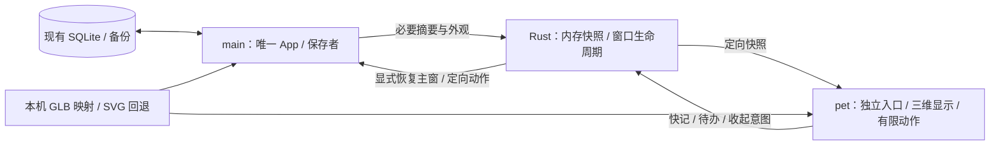

# 独立三维桌宠与简洁工作区：高层方案

日期：2026-10-07。阶段产物：方案，尚未实现或原生验收。

本轮修订：按 [第 1 轮方案审查](review_notes_hlplan_1.md) 和 [第 1 轮 readiness](review_notes_readiness_1.md) 补齐 H1 提醒资格/真实展示确认、H2 独立协议就绪，以及 Rust revision、主窗重载和动作结果闭环。此次只修订本方案，不改变用户目标或实施边界；修订不等于审查已放行。

权威输入为 [完整实现基线](clarifications.md)，参考 [代码事实](research.md)、[上游做法](industry.md) 与 [用户原话](source_materials/feedback_2026-10-07.md)。保留现有五项 0.8.1 来源元数据修改；本次最终交付统一推进至 **0.9.0**，不把未验收的 0.8.1 当作最终来源。

## 1. 目标与非目标

目标：个人 Windows 构建的五个角色真正加载本机三维模型；独立的小型透明伙伴窗在主窗最小化后继续活动，支持拖动、待机、短距离移动、休息及轻触，并能打开已有快记和待办。记录首屏突出搜索、真实记录与一个新建入口；标题区连续，内容区使用主题滚动条。旧正文宠物仅显示普通短文字，并保留既有纯文本往返。

非目标：不新增商城、养成数值、宠物对话、第二份待办、托盘常驻、后台服务、开机启动、全局键盘监听、其他应用监控或自动 AI 请求。不改 identifier、SQLite schema 与备份版本，不批量清除正文指令。

## 2. 方案总体思路

使用现有 React、Three 与 Tauri。新增独立 pet 前端入口和固定 label 的原生伙伴窗；主窗口仍挂载 App，是笔记、账本、待办及用户偏好的唯一保存所有者。pet 只持有必要的只读摘要和本次运行的动作状态。Rust 负责窗口生命周期、限定来源的桥接和一份小型内存快照，不成为第二套业务存储。

三条边界保持分开：工作区布局/旧正文兼容、模型细化/本机资源、原生桌宠/业务桥接。共用角色渲染器与严格外观解析；不把网页内拖动逻辑硬套为 Windows 窗口拖动，不挂载第二份 App，不造泛化插件或能力平台。

## 3. 关键决策与备选方案

| 决策 | 采用 | 备选与取舍 | 需求映射 |
| --- | --- | --- | --- |
| 窗口与入口 | Rust 在启动时建立固定 pet 窗，初始隐藏；入口选择 pet 模式后只挂伙伴组件 | 前端动态创建需要额外创建权限和防重复逻辑；同 App 双开会触发整库保存。固定隐藏窗生命周期更清楚 | 独立桌面、最小化可见、唯一保存者 |
| 通信与保存 | 主窗发布小摘要，Rust 只缓存当前运行值；定向事件通知，首次/重载可主动读取当前摘要；写命令硬检查 main 来源 | pet 直接读 SQLite 或共享全量 localStorage 会扩大数据边界；只用一次事件有启动丢失风险 | 旧数据安全、实用本地动作 |
| 模型接入 | 存在文件才进入构建的五角色 URL 映射；第三方 refined GLB 只放忽略的本机目录 | DEV 文件选择不能交付正式 EXE；固定远程/不存在 URL 会误报三维支持；新桌面框架无必要 | 五角色真实三维、个人构建与公开回退 |
| 自主活动与 UI | 小窗口有限计时行为；主界面收敛现有入口和滚动所有者 | 养成/系统监控超出实用目标；全屏透明宿主放大点击阻挡；仅 CSS 装饰不能桌面移动 | 灵活自主、简洁和截图问题 |

## 4. 窗口、权限与所有者

### 原生窗口

- main 保持现有 identifier 和配置来源。pet 使用明确 label、同包本地入口、透明背景、无装饰/阴影、不显示任务栏按钮、禁止调整尺寸。建议主体窗口约 220 × 260 逻辑像素，菜单不扩成大面积透明层；尺寸由实际模型与 Windows 点击区域验证后定。
- pet 可以置顶，但启动、恢复与自主定位均不得自动 setFocus。初始不聚焦；只有用户明确选择快记/待办才恢复并聚焦 main。鼠标主动操作属于显式交互，必须核验是否意外打断其他应用输入。不要把 `focus:false` 误说成永久不可激活。
- Rust 的 main CloseRequested 明确退出整个进程，关闭 pet 与全部资源；main 最小化不改变 pet 的显示/动作许可。pet 的关闭行为转为“收起”，同步主窗偏好，保留从设置重新显示的入口，不遗留后台窗口。
- main 发布 protocolReady 摘要后再按用户显示偏好显示 pet。现有业务 UI `ready` 沿用既有加载/浏览器回退路径；新增的伙伴 `protocolReady` 只有 **本次 SQLite 数据加载成功、main 动作监听注册完成** 两个条件同时满足才为真。SQLite catch 即使把业务 ready 置真，也不能开启伙伴协议或发布浏览器旧摘要。失败时 pet 隐藏，主窗既有错误反馈另明确“桌面伙伴暂不可用”；不把隐藏说成用户已收起。后续成功重新初始化方可恢复 protocolReady，不新增自动重试平台。

### 最小权限与后端门禁

main 沿用窗口拖动/最小化/最大化/关闭权限；pet 单独 capability 匹配精确 label，只给予实际采用的事件监听/取消，以及自身位置、大小、当前显示器查询、移动和原生拖动权限。事件发射可由限定来源的 Rust 命令承担；不要给 pet `core:default` 或窗口创建通配权限。若实施选择更多 JS API，必须逐项对照安装版本权限源并说明用途。

Rust 对主窗摘要发布和现有 `save_data` 增加调用窗口 label 为 main 的检查；pet 不能调用保存命令。pet 的只读摘要/动作命令限制 pet 来源，main 恢复显示命令限制 main 来源。业务加载、AI 命令同样明确拒绝 pet 使用，避免以后误把调用能力等同于拥有数据。使用实际 caller window，不信任 payload 自报 label。

`src/main.tsx` 必须在挂载前分入口，pet 模式不 import/挂载 App 的业务副作用；pet 使用独立样式域，不能继承主体光场、最小宽度或 PWA 注册造成黑色矩形。入口选择可复用同一 HTML 的明确本地 pet 参数，不新增导航框架。正常 Web 入口保持原工作区；没有原生桌面时保留既有网页伙伴回退即可。

### 实读 API 依据与限制

补充核对了 `node_modules/@tauri-apps/api/window.d.ts`、`event.d.ts`，以及本机 `tauri-2.11.5` 的 permissions/event、permissions/window reference 和 Rust app/window/webview 源。Monitor.workArea 包含物理位置/尺寸，明确排除任务栏；事件 listener 需要 unlisten；Rust 提供窗口 close 生命周期与 AppHandle exit。startDragging 返回值只保证操作结果，文档没有保证 Promise 覆盖整个用户拖动周期。上述可用性不代表实际透明、焦点和后台活动已经验证。

## 5. 必要摘要与动作协议

协议限当前功能的小摘要和有限意图/结果，不新增总线框架。revision 由 Rust 接收每次状态更新时递增分配，main 前端不持有或重置计数；Rust 只在当前进程内保留计数和当前快照。

| 消息 | 来源 → 接收者 | 最少内容 | 所有者/效果 |
| --- | --- | --- | --- |
| 伙伴快照 | main → Rust 内存 → pet | Rust revision、protocolReady、外观四字段、主题、显示偏好、动态偏好、本机日期、到期待办总数及最多五项标题、可空提醒资格（日期及提醒 token） | main 派生业务值和资格；Rust 附加单调 revision；不含笔记/账本正文、全量 todos、凭据 |
| 快照读取 | pet → Rust | 无业务写入内容 | 首次/重载恢复当前值；监听先建立，再读取；按 revision 拒绝较旧响应 |
| 用户意图/展示确认 | pet → Rust → main | 有限枚举：快记、待办、收起、提醒已展示；单次请求标识；展示确认只带当前日期及 token | main 执行业务 UI/记录日期键，Rust 仅对显式快记/待办 show/unminimize/focus main |
| 动作结果 | main → Rust → pet | 对应请求标识及有限结果：已处理、当前界面阻塞、不可用；简短原因 | main 确认真正执行结果；Rust 自身恢复窗口/来源检查失败直接返回错误 |

main 初始化或前端重载先向 Rust 标记本次 owner 尚未就绪，Rust 清除旧待提醒资格、隐藏 pet 并递增 revision；随后建立 main listener、成功加载 SQLite，才发布 protocolReady 快照。Rust 赋予本次 main 初始化一个 owner 代次，只接受当前代次的发布/处理结果，防止旧异步 load、旧监听或旧结果在重载后覆写新状态。计数保留在 Rust，故 main 重载不使 pet 卡在旧 revision；pet 重载按监听先建立、再读取当前快照恢复，晚到较旧响应无效。每次 main 初始化最多一份 listener 和一次加载，不新增持续 heartbeat 或重试队列。

之后只随所需值变化发布。待办摘要沿用本机 `dueDate <= today && !done` 的既有判断，日期更新由 main 现有本机日期计时器提供。pet 不依据第二份旧数据计算，也不写任何业务存储。进程完全重启后从新 revision 开始，pet 同时为新实例，无跨进程历史合并需要。

快记调用现有新建 NoteComposer，待办转到已有 TodoView；不新增编辑器。若已有未保存编辑器/导入确认/年轮等阻塞界面，先恢复主窗并保留当前上下文，返回“当前界面阻塞”并提示先处理当前界面；不替换草稿、不自动完成或删除任务、不长期排队执行过期操作。每次 pet 只允许一个显式动作处理中，main 对同一请求标识仅处理一次并返回结果；结果才解除按钮。Rust 恢复窗失败、当前 protocol 未就绪或 main 处理失败返回可见原因，不能仅因 show/focus 成功称快记已打开。限定短超时后恢复按钮并提示“未确认，请查看晴笺”，不自动重放；迟到结果按请求标识识别，不触发第二次业务操作。去重只保留当前/最近一次请求，无持久队列或通用 ack 框架。

到期待办提示为伙伴旁简短数量/最多五项的局部提示，不持续抢焦点或重复弹窗。一次/日链路明确如下：

1. main 仅在 protocolReady、用户显示偏好为开、当前日期有到期待办且既有 `luma-todo-reminded:<date>` 尚未记录时发布提醒资格。Rust 为当前进程/当前本机日期分配稳定 token；main 重载不更换同日期 token，日期变化才换 token。休息和当前 pet 真正可见性由 pet 控制是否展示，资格本身不等于已经提醒。
2. pet 只有原生窗已显示、局部提示已真正呈现且未休息时，回传“提醒已展示”的日期/token；隐藏、尚未就绪、休息、加载/显示失败或尚未呈现的 render 均不确认、不记键。确认发生在提示可见提交后，原生实际可见性仍须最终 EXE 核验。
3. pet 在本窗口 sessionStorage 只留最后已展示 token，作为重载去重的临时 UI 标记（不保存业务数据或用户偏好）。同 token 重载不再自动展开提示，但可以再传展示确认，以闭合先前已显示而确认未抵达的情况；没有真的展示过则不能写这个标记。Rust 保留同日期 token，main 重载后的资格可以复用该确认，而不会重新展示。
4. main 校验本次 protocolReady、当前本机日期、当前有效 token/资格和日期键；只有首次有效确认才写既有日期键并发布资格为空的新快照。重复确认幂等；旧日期、失效 token、尚未就绪、到期项已无或已记键的确认不产生新写入。晚到确认不消耗新日期资格。确认和 owner 重载并发时，pet 在读取新资格后可重传有效同日期确认，不能重放快记/待办动作。
5. 桌面模式禁用 main 原有自动 todoReminder effect/自动记键路径，由上述链路唯一负责自动一次/日记录；Web 回退保持既有路径。手动打开待办不受资格或日期键限制，也不冒充自动提醒展示。减少动态只停动画，静态提示仍可显示；用户休息和隐藏暂停自动提示。自动提醒不触发 show/focus main。

收起由 main 更新现有显示偏好，再发布隐藏状态并让 Rust 隐藏 pet；设置“显示伙伴”执行反向路径。不依赖 storage event 当作跨窗协议，也不让 pet 修改外观/偏好存储。main 最小化不撤销监听或发布责任。

## 6. 有限自主行为、拖动与清理

- 复用 idle/happy/resting/dragging 的显示含义，加一个本地“正在自主移动”标志即可；不建立全局状态机框架。低频选择待机、小段横向活动或短暂休息，轻触调用 happy 后回到待机。自动休息有限时长；用户休息持续到唤醒，两者分开。
- 短距离窗口活动以窗口位置为准，每段建议不超过 60–90 逻辑像素、约 1–2 秒，决策间隔数十秒；窗口位移建议约 10fps，Three 连续动画封顶约 30fps，使用现有局部可取消计时，不让 WebGL 每帧再额外做一次 OS 查询，不引入通用调度器。首次实现可复用 idle clip 随窗口移动，文案称“短距离活动”；没有 walk/rest clip 的模型不能声称已支持行走/睡眠骨骼动作。
- 鼠标进入、按下、打开局部操作、人工拖动时立即撤销自主位移与待决策计时。离开交互后重新开始等待，避免手拖期间窗口被自动拉回。原生拖动用已有 API；通过窗口 moved 与短暂稳定检测确认结束，不假设 startDragging Promise 等待松手。停止事件丢失时保持不自主移动优先于抢回位置。
- 每次自主活动前查询当前 monitor/workArea、窗口物理位置及 outerSize；整个轨迹在 **物理坐标** 中 clamp，逻辑距离仅在目标显示器 scaleFactor 下换算一次。支持负坐标显示器，不把 workArea 原点当作 0；人工跨屏拖动结束/scale change 时重新取边界及尺寸，不复用旧 DPI。屏幕变化或当前 monitor 缺失时停止活动，再以可用显示器重新安置；不自行推断默认显示器大小。
- 休息、动态偏好关闭、系统减少动态、pet 真正隐藏/关闭时，取消自主计时、移动帧与模型动画；隐藏时卸载/释放 scene。pet document blur 不代表隐藏，不能继承现有网页 focus 门槛，否则切到其他软件就停止陪伴。main pageVisible、composer 状态不控制 pet 生存。
- 每个组件清理自身 timer、RAF、pointer 状态、window/DOM/media listeners 和异步订阅；异步注册后若组件已退出立即 unlisten。模型切换/上下文丢失复用 Pet3DView 的取消、ResizeObserver 与 dispose；自主移动异步 setPosition 的晚到回调需按本次动作身份拒绝继续。
- 小透明窗的透明像素是否透传鼠标是 U2 待测项，不宣称自动逐像素穿透。首版不动态切换整窗 ignoreCursorEvents 导致无法再点回；先通过缩小固定宿主与原生测试控制阻挡面积。

## 7. 模型细化与个人打包

原始模型保留；新候选使用 `E:/pet-model-workbench/refined/2026-10-07`，保存新 `.blend`、GLB、前/侧/背与桌面尺寸预览及 manifest。晴小团保留用户已接受的轮廓，优化材质、眼高光/动作；四角色重点改善圆润耳型、贴合面部分区、角色眼神与嘴型，按角色比例独立调整，避免继续用相同点眼/通用折线嘴。结合协调者补充的实际 SVG/脚本核对，奶龙强调大黄头、宽吻、白肚、绿虹膜/暗瞳/高光、脚趾和侧尾，修正初模顶部圆耳的熊形观感；小八蓝纹贴合头面，猫耳采用圆润三角形态。模型包可增加眨眼、休息和短距步行 clip，但 renderer 必须以实际 clip 存在为准，缺少时诚实退回 idle；原创轮廓保持。新路径是方案，不标成已有合格资产。

所有五个 GLB 保持 PetRoot 与 idle/happy clip 契约；refined 四角色可补齐现有 Beret/Halo/Scarf/Bow 节点以复用衣橱。角色身体本色保持，配色仅影响装饰；scene 在非原创模型上只显示/染色这些实际装饰节点。若某角色最终没有节点，就在该角色三维模式隐藏不生效的装扮组，并给简短原因，不能显示虚假的成功反馈。仅需已有节点存在判断，不新增泛化 capability 系统。

项目内为私有模型设置一个明确 `.gitignore` 目录，例如 `src/local-pet-models/`；Vite 仅对实际存在 GLB 生成 URL 映射。原创公开 GLB 保持正式兜底路径；缺失/加载失败的四角色回退现有 SVG。伙伴页预览、网页伙伴及独立桌宠共用该解析边界，正式构建不再依赖 DEV picker。DEV 临时预览仍属开发工具，不当作最终交付。

个人构建前明确复制 refined 来源并记录 SHA；个人 0.9.0 EXE 必须逐角色验证映射命中 GLB。公开源码和文档不提交四角色模型或私有制品，公开构建可缺少私有目录。SW 会缓存打入包的 GLB，故个人 dist/安装器也按私有制品处理，不发布为公开包。manifest/哈希为溯源证据，不能替代视觉满意度。

## 8. 简洁工作区与旧正文兼容

主窗外层锁定视口，固定连续标题/顶部操作区，共用现有光场背景；标题栏撤去纯纸色遮挡和分隔线。品牌只出现一次，保留拖动区域、窗口按钮和清楚的焦点边框。内容区为唯一工作区纵向滚动 owner，模态框/编辑器继续各自必要 overflow；浅深主题采用细但可操作的滚动条，不隐藏滚动能力。

主导航突出记录、待办、账本；记录时光、关联图、伙伴放在“更多”可发现入口。回收站/设置保留次级可访问位置；搜索为记录主工具，保留 Ctrl K 但撤重复的大快速打开按钮或收成搜索提示。AI 保留显式入口，收进次级操作；不增加自动网络行为。

记录页压缩为简短标题/条数、筛选/排版和记录列表，撤重复眉题、说明与大起笔板；只有空列表保留起笔引导。常驻排序说明改为抓手 tooltip/可访问描述；正文点开编辑与已有动作语义保持，不把所有卡片交互重新设计。二级菜单、窄屏布局、筛选加载和焦点返回须手测；避免做无关重构。

桌面端不再渲染工作区内 PetCompanion 浮层，伙伴设置/角色选择仍可从更多进入；Web 可沿用网页内伙伴作为非原生回退。正文删除插入按钮、处理及嵌套 React/WebGL root；已有 `[[pet:xiaotuan]]` 受限解析保留。阅读只渲染普通“晴小团”文字，编辑回填为固定短文字的不可编辑 legacy host；序列化仍识别该 host 回原指令，可用 Backspace 整块删除/撤销恢复，未知/转义/fence 字面值行为保持。不批量迁移，也不向用户暴露内部语法。

## 9. 风险与验证映射

| 风险 | 缓解设计 | 必须得到的证据 |
| --- | --- | --- |
| U1 模型未达满意度 | refined 与旧资产并存，真实多视角/小尺寸比较 | Blender 导出/重导，五 GLB结构/clip，实际桌宠截图；造型仍由用户判断 |
| U2 透明/焦点/DPI/后台 | 独立入口、小窗口、物理工作区、可取消活动 | 精确 EXE 原生双窗；切其他应用、主窗最小化、拖动、任务栏边界、关闭清理；多屏/不同 DPI 不具备时记未测 |
| U3 旧正文丢失/语法外露 | 受限 codec 与 legacy host 保留，无全库写入 | 原指令往返/转义/未知/fence 测试；连续输入、格式、草稿、保存回填、删除撤销、深色 UI |
| U4 过期摘要覆盖业务/动作丢失 | 唯一 main 保存、caller门禁、监听先建/revision | Rust 拒绝 pet 写、主窗新数据后 pet 动作无回滚；重载/快速重复动作/编辑中点击/日期更新 |
| U5 资产和制品错来源 | 本机 ignore、来源 SHA、0.9.0一致身份 | 无私有目录的公开 build 回退；个人 build 五GLB；EXE精确路径/版本/SHA与启动进程路径，旧库字段前后比较 |
| U6 动作名和实际效果不一致 | 首版活动复用 idle，休息静止；新增clip只按实际命名使用 | 暂停/唤醒/轻触/移动的实际观察，计时器/RAF清理；不拿类型/格式验证冒充动作观感 |

Web 与 Rust 命令验证须 fresh，保留失败；原生验收不能由浏览器截图或版本号替代。数据库比较限定只读核查与授权测试数据，保留真实旧库副本，不覆盖正在运行的旧 EXE。最终同步 README、CHANGELOG、Project.Progress、Pet.Wardrobe、Release.Testing 及 0.9.0 验证文档。

## 10. 向 LW Plan 的拆解指引

1. **界面/旧正文包**：滚动 owner、连续标题和导航收敛、正文 legacy host。明确 DOM 焦点/响应式和已存在行为的回归路径；不得混入模型或窗口重构。
2. **模型包**：refined 生成与多视角证据、五角色资源映射和真实装扮节点、缺资源回退。与窗口包约定 model URL、original 和实际节点契约；私有资产不入 Git。
3. **桌宠包**：固定窗和入口、Rust caller门禁/摘要/动作、主窗发布与显式业务路由、独立活动/DPI/清理。低层计划需落到事件名称、快照字段、注册时序、权限列表、动作取消与已编辑状态策略；不新增通用消息总线。
4. **交付包**：保留来源五项版本改动再统一 0.9.0、同源测试/build/Rust检查、私有制品记录、原生实测和数据库比较。实际 diff 超约一千行时按上述逻辑分提交；生成物保持忽略。

## 跨功能事实（待确认）

### 架构与约束

- [2026-10-07] 多窗口不能以“同一来源 localStorage”为由各自挂 App；现有全量 SQLite 保存需要唯一写所有者和后端 caller 检查。
- [2026-10-07] 已安装 Tauri 的 Monitor.workArea 是物理坐标且排除任务栏；混合 DPI 定位需要结合窗口物理 outerSize，不只按 CSS viewport clamp。

### 经验与教训

- [2026-10-07] 独立窗生命周期必须区分最小化与关闭；自动窗口动作不应抢主窗焦点，显式快记/待办才恢复主窗。
